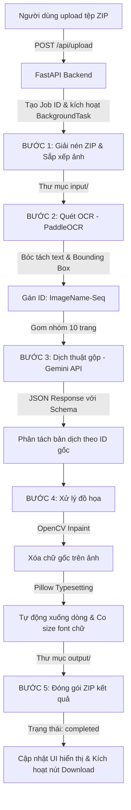

# Hướng Dẫn Kỹ Thuật & Kiến Trúc Hệ Thống (Technical & Architecture Guide)
## Dự Án: Manga Translation Automation Pipeline
**Tác giả**: Đội ngũ Phát triển Kỹ thuật Hệ thống (Senior System Architect)

Tài liệu này được biên soạn dành cho các lập trình viên để hiểu rõ kiến trúc, các công nghệ sử dụng, luồng đi của dữ liệu, cấu trúc thuật toán lõi, và định hướng mở rộng hệ thống Manga Translation Automation trong tương lai.

---

## 1. Bản Đồ Công Nghệ (Technology Stack)

Hệ thống được thiết kế theo mô hình **Client-Server đơn giản nhưng tối ưu hiệu năng**, giảm thiểu tối đa tài nguyên sử dụng và tích hợp trực tiếp vào môi trường máy cục bộ (Local), Docker, hoặc nền tảng đám mây Google Colab.

| Thành phần | Công nghệ lựa chọn | Lý do lựa chọn & Vai trò |
| :--- | :--- | :--- |
| **Backend Framework** | **FastAPI** (Python 3.10+) | Hỗ trợ lập trình bất đồng bộ (Asynchronous), hiệu năng vượt trội, tích hợp sẵn cơ chế chạy tác vụ ngầm (`BackgroundTasks`) và Server-Sent Events (SSE) để stream tiến trình thời gian thực. |
| **OCR Engine** | **PaddleOCR** (Baidu) | Công nghệ nhận diện ký tự quang học dạng Lightweight tốt nhất hiện nay cho truyện tranh. Có khả năng nhận diện đa ngôn ngữ (Anh, Trung, Nhật, Hàn) với độ chính xác cao và tốc độ xử lý nhanh (tối ưu hóa khi chạy GPU). |
| **Dịch thuật AI** | **Gemini 1.5 Flash API** | Tận dụng Context Window khổng lồ để dịch gộp (Batching) theo nhóm trang giúp AI hiểu mạch truyện, tự động bắt xưng hô chính xác. Sử dụng tính năng **Structured Output (JSON Schema)** để chống lệch cấu trúc. |
| **Xóa chữ ảnh** | **OpenCV** (cv2) | Sử dụng thuật toán Inpainting (`cv2.inpaint` với cờ `INPAINT_TELEA`) kết hợp giãn nở mặt nạ (`cv2.dilate`) để tái tạo pixel nền một cách tự nhiên mà không cần dùng tài nguyên GPU lớn như các mô hình AI Inpainting (LaMa). |
| **Vẽ chữ mới** | **Pillow** (PIL) | Thư viện xử lý ảnh mạnh mẽ của Python. Dùng để xử lý vẽ chữ đè, căn lề tự động, tạo nét viền (stroke) chữ để tăng độ tương phản và tự động co giãn kích thước chữ (Auto font scaling). |
| **Giao diện Web** | **Vanilla HTML5 / CSS3 / JS** | Thiết kế theo phong cách **Glassmorphism** sang trọng, hiện đại. Dùng **EventSource API** của Javascript để nhận log console thời gian thực thông qua SSE của backend mà không cần cấu hình Websocket phức tạp. |

---

## 2. Luồng Chạy Chi Tiết Hệ Thống (Workflow & Data Flow)

Hệ thống hoạt động theo mô hình tuyến tính chia làm 5 bước xử lý tuần tự (Pipeline). Dưới đây là sơ đồ luồng dữ liệu chi tiết từ lúc người dùng tải tệp ZIP lên đến lúc tải về tệp kết quả:



### Chi tiết hành vi các endpoint tại [main.py](file:///d:/MANGA%20TRANSLATION%20AUTOMATION/app/main.py):
*   `POST /api/upload`: Nhận tệp ZIP từ client cùng các tham số cấu hình (`api_key`, `src_lang`, `tone`, `batch_size_pages`). FastAPI lưu tệp tạm thời, khởi tạo bản ghi trong biến global `jobs` với trạng thái `processing`, sau đó kích hoạt hàm `run_job_in_background` chạy bất đồng bộ và trả về `job_id` ngay lập tức cho client (tránh timeout HTTP).
*   `GET /api/stream-progress?job_id=...`: Mở kết nối Server-Sent Events (SSE). Hàm generator liên tục kiểm tra biến global `jobs[job_id]["logs"]` để yield dòng text log mới nhất về cho client hiển thị lên Console. Kết nối tự ngắt khi job chuyển sang trạng thái `completed` hoặc `failed`.
*   `GET /api/download/{job_id}`: Trả về tệp ZIP kết quả sau khi đã dịch sạch sẽ.

---

## 3. Thuật Toán Lõi & Thiết Kế Code (Core Algorithms)

### 3.1. Thuật toán Xóa Chữ Tự Nhiên (Inpainting)
Để khắc phục vấn đề làm lem nhem hoặc để lại viền bóng chữ cũ khi xóa chữ, hệ thống thực hiện qua các bước xử lý hình học sau trong [pipeline.py](file:///d:/MANGA%20TRANSLATION%20AUTOMATION/app/pipeline.py):

1.  **Tạo mặt nạ nhị phân (Binary Mask)**: Khởi tạo ảnh mask đen hoàn toàn (`np.zeros`) cùng kích thước với ảnh gốc. Với mỗi tọa độ hộp thoại từ OCR (4 điểm polygon), vẽ đa giác trắng (`255`) đặc lên mask bằng `cv2.fillPoly`.
2.  **Giãn nở mặt nạ (Dilation)**: Phông chữ gốc thường có đường viền mờ hoặc đổ bóng rìa. Chúng ta sử dụng bộ lọc cấu trúc Rectangular Kernel kích thước $5 \times 5$ chạy lệnh `cv2.dilate` để mở rộng vùng biên mask thêm 2-3 pixel ra ngoài.
3.  **Tái tạo nền (Inpaint)**: Sử dụng hàm `cv2.inpaint` với thuật toán Telea giúp quét vùng màu nền xung quanh ô chữ và bù đắp nội dung hòa quyện tự nhiên.

### 3.2. Thuật toán Căn Chỉnh & Co Giãn Chữ Tự Động (Auto-scaling & Typesetting)
Được triển khai trong hàm `draw_text_in_box` và `wrap_text` của [pipeline.py](file:///d:/MANGA%20TRANSLATION%20AUTOMATION/app/pipeline.py):

*   **Xuống dòng tự động (Text Wrapping)**: Nhận chuỗi chữ Việt, phân tách thành danh sách các từ. Duyệt từng từ và tính toán độ rộng của dòng hiện tại thông qua `font.getbbox(test_line)`. Nếu vượt quá độ rộng của ô thoại `(x2 - x0)`, từ đó sẽ được đẩy xuống dòng tiếp theo.
*   **Tự động co kích thước chữ (Auto font-size scaling)**: 
    *   Hệ thống thử nghiệm font size giảm dần từ `28` xuống `10` (bước giảm `-2`).
    *   Với mỗi cỡ font, chạy thử hàm wrap chữ để lấy danh sách các dòng và đo tổng chiều cao khối văn bản: $\text{TotalHeight} = \sum \text{Chiều cao các dòng} + 4 \times (\text{Số dòng} - 1)$.
    *   Nếu tổng chiều rộng lớn nhất của dòng nhỏ hơn chiều rộng ô thoại `box_w` **VÀ** tổng chiều cao khối chữ nhỏ hơn chiều cao ô thoại `box_h`, cỡ font đó sẽ được chọn.
    *   Nếu không cỡ font nào vừa, hệ thống ép về cỡ chữ tối thiểu là `10`.
*   **Căn giữa đa chiều (Centering)**:
    *   Căn dọc: Tính điểm bắt đầu vẽ `y_start = y0 + (box_h - total_text_h) / 2`.
    *   Căn ngang: Với mỗi dòng vẽ, tính điểm bắt đầu `x_start = x0 + (box_w - line_width) / 2`.
*   **Tạo viền tương phản (Stroke)**: Vẽ chữ màu đen kèm nét viền ngoài màu trắng (stroke_width=2) để đảm bảo dù chữ nằm đè lên bong bóng thoại trắng hay hình nền truyện có màu tối thì chữ vẫn hiển thị sắc nét, dễ đọc.

---

## 4. Hướng Dẫn Bảo Trì & Phát Triển Mở Rộng (Scalability Guide)

Nếu bạn muốn nâng cấp hệ thống trong tương lai, dưới đây là các lối mở thiết kế sẵn:

### 4.1. Thay đổi hoặc nâng cấp mô hình Inpainting (Ví dụ: LaMa AI)
*   **Hiện tại**: Dùng `cv2.inpaint` chạy CPU cực nhanh (khoảng 0.05s / trang) nhưng đối với các hình nền vẽ tay nhiều chi tiết, nền phức tạp có thể bị nhòe nhẹ.
*   **Mở rộng**:
    1.  Cài đặt mô hình LaMa Inpainting (hoặc một API inpainting ngoài như Stable Diffusion Inpaint).
    2.  Tại hàm `erase_text` trong [pipeline.py](file:///d:/MANGA%20TRANSLATION%20AUTOMATION/app/pipeline.py), thay thế đoạn code OpenCV bằng đoạn gọi model inference:
        ```python
        # Ví dụ giả lập tích hợp model AI Inpainting chuyên sâu
        inpainted_img = lama_model.predict(cv2_img, mask)
        ```

### 4.2. Dịch thuật theo bong bóng dọc (Manga Nhật đọc từ phải qua trái)
*   **Hiện tại**: Lấy chữ theo thứ tự ngẫu nhiên của PaddleOCR hoặc sắp xếp từ trên xuống dưới.
*   **Mở rộng**: Để hỗ trợ thứ tự đọc chuẩn truyện tranh Nhật bản (từ phải qua trái, từ trên xuống dưới), bạn có thể viết lại hàm sắp xếp các ô thoại của một ảnh trước khi đưa vào dịch thuật:
    ```python
    # Sắp xếp các ô thoại theo tọa độ x giảm dần (phải qua trái) và y tăng dần (trên xuống dưới)
    items.sort(key=lambda item: (-item["bbox"][2], item["bbox"][1]))
    ```

### 4.3. Tối ưu hóa GPU trên Colab
*   Khi triển khai trên Google Colab, mặc định PaddleOCR sẽ sử dụng CPU nếu không cài bản GPU chuyên dụng. Hãy luôn đảm bảo hướng dẫn người dùng chạy lệnh:
    ```bash
    pip install paddlepaddle-gpu -i https://mirror.baidu.com/pypi/simple
    ```
    Hệ thống sẽ tự động phát hiện GPU và chuyển đổi trạng thái tăng tốc độ xử lý OCR lên gấp 10-20 lần.
